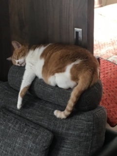

# A Sample Article
## Write a diary

What shall I write?  
Anyway, **I am poor at English**, so I can not write it for too long.

Let's also talk about the parents' cats.



It is not cute at all. In the first place she is looking down on me.

There are many people who say cats are "cute", but I personally think that they are different.  
If cats have a good point, the cats themselves are "__free__" and "__peaceful__".

Freedom and peace are good things. Therefore, I think that it is healed by seeing a cat stupidly. It is regrettable!

## Write a sentence about programming

I do not know much about programming too.  
This command is made with Node.js, so let's talk about it.

I did not know how to generate the relative path of the URL, so this time I wrote like the following code.

```
export function toRelativeUrl(fromPath: string, toPath: string): string {
  // NOTICE: Originally `path.relative()` should not be used for URLs.
  //         In this time, there is probably no inconsistency, so there is no problem.
  const relativeDir = path.relative(
    path.dirname('.' + fromPath),
    path.dirname('.' + toPath)
  );
  return path.join(relativeDir, path.basename(toPath));
}
```

How do you usually write?
